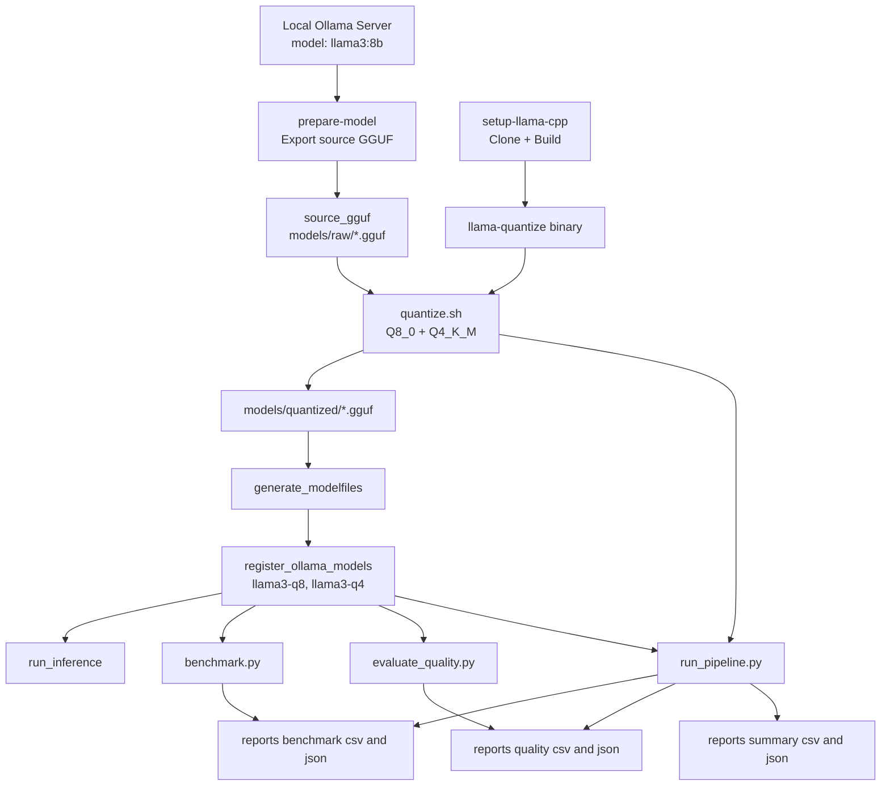

## LLM-Quantization-Lab

LLM quantization project built around `llama.cpp` + `Ollama` + `GGUF`.

This repository helps you run a practical quantization workflow for `llama3:8b`, compare quantization variants (`Q8_0` vs `Q4_K_M`), and generate benchmark + quality reports with pass/fail criteria.

### Goals

- Build and use local quantization tooling (`llama.cpp`)
- Export a source GGUF from local Ollama
- Generate quantized variants (`Q8_0`, `Q4_K_M`)
- Register quantized models in Ollama
- Measure latency, throughput, memory indicators, and quality drift
- Produce summary artifacts for decision making

### System Design



### Project

```text
.
├── config/
│   └── config.yaml
├── llm_quant/
│   ├── cli/                 # command entrypoints
│   ├── config/              # config loader + path resolution
│   ├── core/                # benchmark, quantization, quality, ollama client
│   ├── orchestration/       # end-to-end pipeline
│   ├── logging_utils.py
│   └── setup.py             # setup orchestration utilities
├── models/
│   ├── raw/
│   ├── quantized/
│   └── modelfiles/
├── reports/
│   ├── benchmark/
│   ├── quality/
│   ├── summary/
│   └── logs/
├── setup/
│   ├── bootstrap/
│   ├── llama_cpp/
│   └── models/
├── scripts/
│   ├── run_inference.py
│   ├── benchmark.py
│   ├── evaluate_quality.py
│   ├── run_pipeline.py
│   └── quantize.sh
├── requirements.txt
└── llm_quantization_poc.md
```

### Prerequisites

- macOS (Apple Silicon recommended)
- Python 3.10+
- `uv` (recommended) or `pip`
- `git`
- `cmake`
- Ollama running locally (`http://localhost:11434`)

Install Python dependencies:

```bash
uv pip install -r requirements.txt
```

### Configuration

Primary config: [`config/config.yaml`](config/config.yaml)

Key sections:

- `setup`: llama.cpp build paths + source model export settings
- `paths`: model/report/log artifact locations
- `quantization`: variant definitions and fallback behavior
- `ollama`: endpoint, timeout, streaming behavior
- `benchmark`, `quality`: models/prompts/repeats
- `success_criteria`: pass/fail thresholds
- `logging`: level, format, timestamped file logging

### One-Time Setup

1. Build `llama.cpp`:

```bash
./setup/llama_cpp/setup_llama_cpp.sh
```

2. Pull + export source GGUF from local Ollama:

```bash
./setup/models/prepare_llama3_model.sh
```

3. Generate Modelfiles for quantized variants:

```bash
./setup/models/generate_modelfiles.sh
```

Optional single command bootstrap:

```bash
./setup/bootstrap/bootstrap_local.sh
```

### Run Workflows

#### 1) Quantize models

```bash
./scripts/quantize.sh
```

#### 2) Register quantized models in Ollama

```bash
./setup/models/register_ollama_models.sh
```

#### 3) Run inference (streaming enabled by default)

```bash
python3 scripts/run_inference.py --prompt "What is LLM quantization ?"
```

#### 4) Run benchmark

```bash
python3 scripts/benchmark.py
```

#### 5) Run quality evaluation

```bash
python3 scripts/evaluate_quality.py
```

#### 6) Run full pipeline (re-runs quantize + benchmark + quality + summary)

```bash
python3 scripts/run_pipeline.py
```

### Outputs

- Benchmark: `reports/benchmark/benchmark_results.csv|json`
- Quality: `reports/quality/quality_results.csv|json`
- Summary: `reports/summary/summary.csv|json`
- Logs: `reports/logs/llm_quant_YYYYMMDD_HHMMSS.log`

### Logging

- Logging is configured via `config/config.yaml -> logging`
- Console + file logging are enabled by default
- Log files are timestamped per run (`file_timestamped: true`)
- `scripts/*.py` wrappers run with verbose mode by default

### Notes

- The Ollama-exported source may already be quantized (for example `q4_0`, `q6_K`), not pure FP16/F32.
- Re-quantization fallback is enabled (`allow_requantize_fallback: true`) for compatibility.
- For highest-fidelity benchmarking, use a true FP16/BF16 source GGUF as reference input when available.


### License

This project is licensed under the terms in [`LICENSE`](LICENSE).
